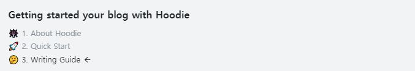

## 1. 포스트 추가하기

`contents/post` 경로에 새로운 마크다운 파일을 생성하여 여러분의 글을 추가할 수 있습니다.

### 1-1. 포스트 파일 구조

새로운 문서를 추가하는 방법에는 두가지가 있습니다. 첫번째는 디렉토리 없이 문서를 생성하는 방법입니다. 만약 여러분이 Javascript 에 관한 문서를 생성한다면, `about-javascript.md` 파일을 `contents/posts` 디렉토리에 추가할 수 있습니다.

두번째 방법은 먼저 디렉토리를 생성한 뒤, 디렉토리 안에 `index.md` 파일을 추가하는 것 입니다. 이 방법은 문서 내에 여러 이미지 파일 등 부수적인 파일 여러개가 포함되었을 때 유용합니다.

첫번째 방법으로 생성한 파일명이나, 두번째 방법으로 생성한 디렉토리 이름은 웹사이트에서 고유의 주소를 갖습니다. `https://siteURL/about-javascript` 와 같이요.

### 1-2. Frontmatter

마크다운은 문서의 메타데이터인 Frontmatter 라 불리는 정보를 가지고 있습니다.

```
---
title: "🤔 3. 작성 가이드"
description: "어떻게 글을 작성하고 추가할까요?"
date: 2021-04-03
update: 2021-04-03
tags:
  - hoodie
  - writing-guide
series: "gatsby-starter-hoodie 로 블로그 시작하기"
---
```

위는 지금 여러분이 읽고 있는 문서의 Frontmatter 입니다. `title` 과 `date` 는 필수 값입니다. 띄어쓰기를 포함된 문자열을 입력할 때에는 따옴표로 감싸는 것을 추천합니다.

### 1-3. 마크다운 작성하기

만약 Frontmatter 까지 작성했다면, 여러분은 그 아래에 마크다운 문서를 작성하면 됩니다. gatsby-starter-hoodie 는 대부분의 마크다운 문법을 지원합니다. 마크다운 작성 방법을 알고 싶다면, Github 의 Mastering Markdown[^1] 문서를 참고하세요.

## 2. 코드 하이라이팅 & Katex

### 2-1. 코드 하이라이팅

Prism.JS 에 기반한 코드 하이라이팅이 제공됩니다.

#### 예시

Javascript

```javascript
console.log("Hello, world!")
```

Python

```python
print("Hello, world!")
```

그 외 더 많은 언어를 제공합니다. 제공되는 언어를 확인하고 싶다면, [Prism.js 웹사이트](https://prismjs.com/) 를 참고하세요.

### 2-2. Katex

Katex 문법을 지원하여 복잡한 수식도 쉽게 표현할 수 있습니다.

#### 인라인 모드

$$E = m c^{2}$$

#### 블럭 모드

$$
\int_{0}^{\infty} f(x) dx
$$

## 3. 글에 이미지 추가하기

상대경로를 이용하여 쉽게 이미지를 추가할 수 있습니다. 디렉토리를 생성하고 그 안에 `index.md` 를 추가하여, 글을 추가하는 방법으로 작성해야 이미지 관리가 쉽습니다.


이미지는 Lazy Loading 으로 로드되어, 빠른 초기 문서 로딩 속도를 확보할 수 있습니다.

> ⚠ 이미지의 모든 확장자는 소문자여야합니다.

## 4. 태그


Frontmatter 의 태그를 통해 쉽게 문서를 분류하고 검색할 수 있습니다. 여러분의 모든 태그는 `https://siteUrl/tags` 경로에서 확인하고, 검색할 수 있습니다.

## 5. 시리즈



여러분이 연관된 여러개의 문서를 작성할 때 시리즈를 사용할 수 있습니다. Frontmatter 에 작성된 시리즈가 같은 문서끼리 묶여 문서 상단에 리스트로 표시됩니다. 시리즈는 일련의 순서가 있는 문서들을 작성할 때 유용하게 사용할 수 있습니다. 시리즈는 문서의 작성 날짜 순서대로 정렬됩니다.

현재 문서는 `gatsby-starter-hoodie 로 블로그 시작하기` 라는 시리즈로 설정되어 있습니다.

[^1]: https://guides.github.com/features/mastering-markdown/
